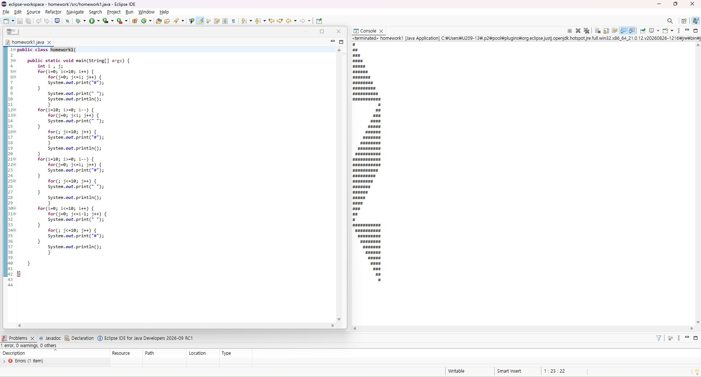

# OOP2026
### Homework1
```java
public class homework1{

	public static void main(String[] args) {
        int i , j;
        for(i=0; i<=10; i++) {
            for(j=0; j<=i; j++) {
            System.out.print("#");
        }
            System.out.print(" ");
            System.out.println();
            }
        for(i=10; i>=0; i--) {
            for(j=0; j<i; j++) {
            System.out.print(" ");
        }
            for(; j<=10; j++) {
            System.out.print("#");
            }
            System.out.println();
        }
        for(i=10; i>=0; i--) {
            for(j=0; j<=i; j++) {
            System.out.print("#");
        }
            for(; j<=10; j++) {
            System.out.print(" ");
        }
            System.out.println();
            }
        for(i=0; i<=10; i++) {
            for(j=0; j<=i-1; j++) {
            System.out.print(" ");
        }
            for(; j<=10; j++) {
            System.out.print("#");
        }
            System.out.println();
            }

	}

}


```

