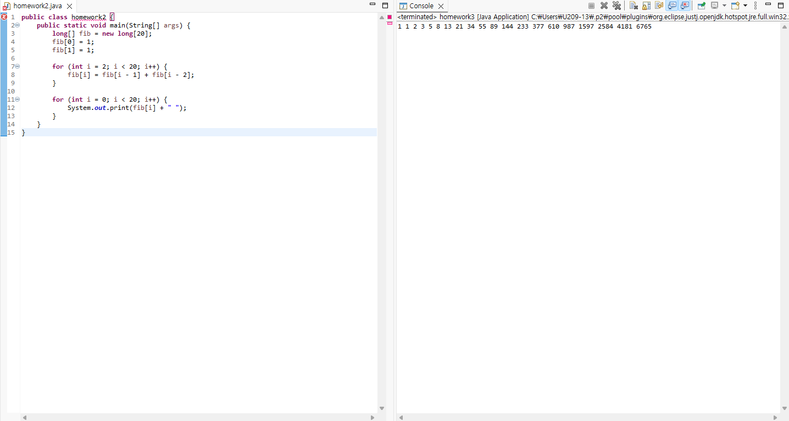
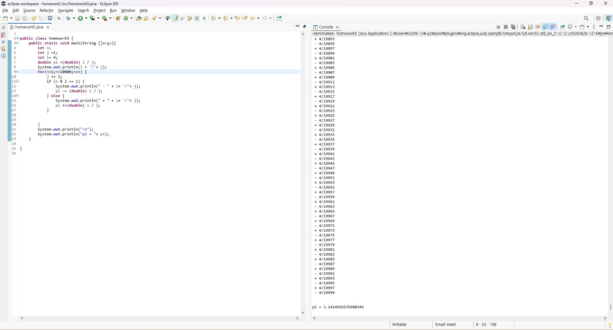

# OOP2026
### Homework1
```java
public class homework1{

	public static void main(String[] args) {
        int i , j;
        for(i=0; i<=10; i++) {
            for(j=0; j<=i; j++) {
            System.out.print("#");
        }
            System.out.print(" ");
            System.out.println();
            }
        for(i=10; i>=0; i--) {
            for(j=0; j<i; j++) {
            System.out.print(" ");
        }
            for(; j<=10; j++) {
            System.out.print("#");
            }
            System.out.println();
        }
        for(i=10; i>=0; i--) {
            for(j=0; j<=i; j++) {
            System.out.print("#");
        }
            for(; j<=10; j++) {
            System.out.print(" ");
        }
            System.out.println();
            }
        for(i=0; i<=10; i++) {
            for(j=0; j<=i-1; j++) {
            System.out.print(" ");
        }
            for(; j<=10; j++) {
            System.out.print("#");
        }
            System.out.println();
            }

	}

}
```

# OOP2026
### Homework2
```java
public class homework2 {
    public static void main(String[] args) {
        long[] fib = new long[20];
        fib[0] = 1;
        fib[1] = 1;

        for (int i = 2; i < 20; i++) {
            fib[i] = fib[i - 1] + fib[i - 2];
        }

        for (int i = 0; i < 20; i++) {
            System.out.print(fib[i] + " ");
        }
    }
}

# OOP2026
### Homework5-1
```java

public class homework5 {
	public static void main(String []args){
		int n;
		int j =1;
		int i= 4;
		double pi =(double) i / j;
		System.out.println(i + '/'+ j);
		for(n=1;n<10000;n++) {
			j += 2;
			if (n % 2 == 1) {
				System.out.println(" - " + i+ '/'+ j);
				pi -= (double) i / j;
			} else {
				System.out.println(" + " + i+ '/'+ j);
				pi +=(double) i / j;
			}
			

		}
		System.out.println("\n");
		System.out.println("pi = "+ pi);
	}


}
```


